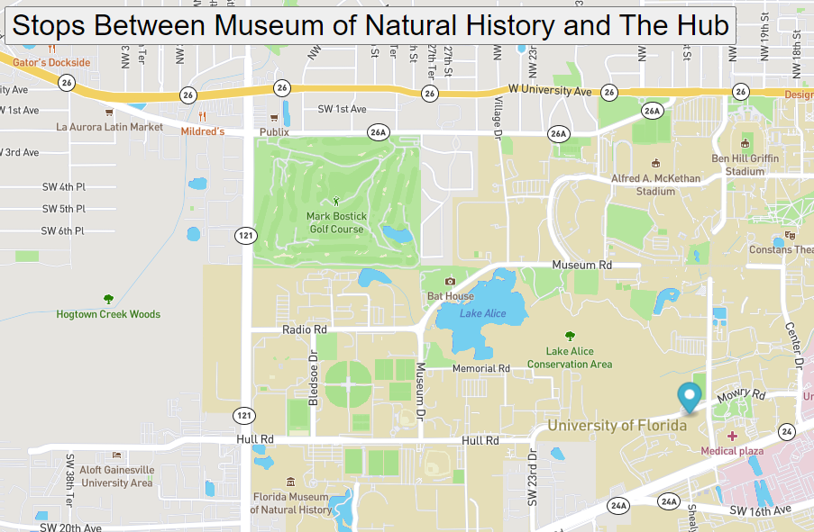

# Real Time Bus Tracker
This program tracks a bus route from the Natural History Museum to The HUB at the University of Florida in Gainesville, Florida.
## How to Run:
Download all of the files onto your computer. Drag the index.html file into your browser. Click the title of the route, and a marker will track the route on the University of Florida campus.

## Future Improvements:
Add additional bus routes on campus; add GPS to the program to track the actual movements of the bus as it travels across campus; add times that the bus will be at each location with a tool tip that appears when you hover over a marker

